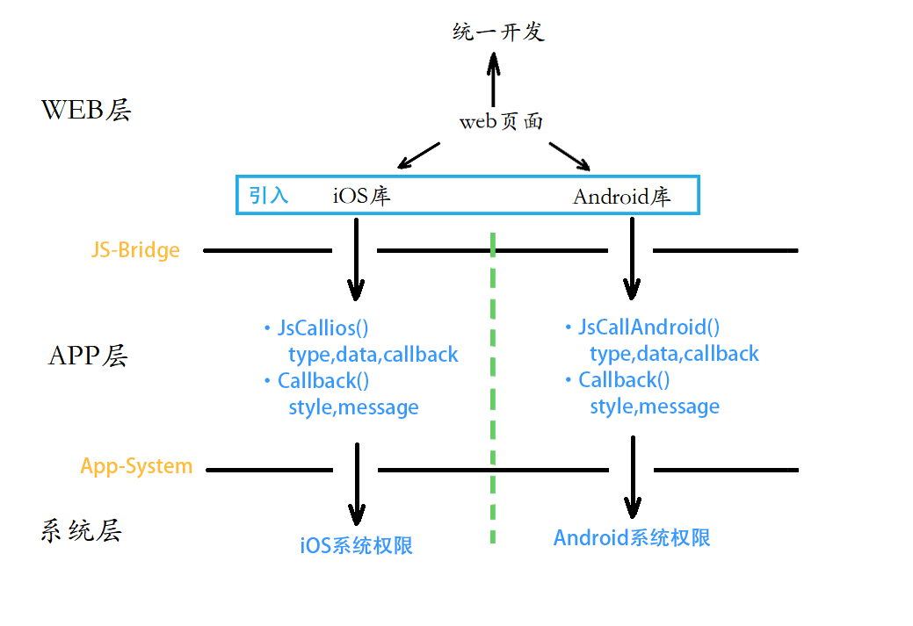

# JS-bridge

[TOC]

## 一、项目简介

本项目为App内嵌H5，通过混合开发（H5与Native之间进行通信），使web不再受限于浏览器，可以通过寄生app来获取系统权限，扩展H5的功能，为web应用带来更多可能。**项目核心在于对混合开发的web端进行封装**，便于后期业务开发。即在后期开发中，只需要将精力放在业务上即可，不需要关注H5与Native之间的通信。为便于测试，开发基于VUE框架的演示页面，并将相关交互功能入植入演示页面中。

## 二、技术分析

- H5应用：开发速度快，更新迭代快，不需要客户端发布新版本，即可实现更新升级。但受限于寄生应用的权限，性能较差，不适合开发复杂的高负载应用。

- Native应用：可以根据需求获取系统权限，在功能与性能上有所保障。但是开发周期长，需要进行版本发布。

目前市面上的主流app都内嵌了H5页面，通过app来获取系统权限，丰富功能，通过H5来实现产品的快速开发迭代。使用混合开发技术，在保证系统功能的前提下，实现了项目的快速更新迭代。

## 三、项目框架

本项目以web页面为核心，通过引入不同操作系统对应的库，实现不同系统应用的统一开发。相关信息如下图所示。



## 四、开发规范

### 1.项目规划

通过原型测试，发现目前移动端两大操作系统Android 和iOS，关于H5-Native通信之间存在一些差别。所以本次项目开发基于webpack的vue多页应用，即Android一套页面，iOS一套页面，通过对Android 和  iOS 的 js-bridge封装，实现对外暴露统一的应用开发接口。在未来开发中，只需要引入不同 js-bridge模块，即可实现统一的开发。

后期可以使用webview客户端检测，再次封装。自动检测操作系统按需加载，再次统一接口，真正实现一套代码，两端同时发布。

### <span id="ml">2.项目目录</span>

```
|JS-bridge #根目录
├── README.md
├── node_module #安装工具
├── build #webpack配置文件
├── config #项目配置文件
├── src #代码目录
	├── assets #静态资源
	├── components #页面组件
	├── pages
		├── Android #Android端页面
			├── Android_module #js-bridge模块文件夹
			├── Android.html #Android端页面
			├── index.js #webpack打包js文件1
			├── Android.js #webpack打包js文件2（便于后期生成CDN）
		├── iOS
			├── iOS_module #js-bridge模块文件夹
			├── iOS.html #iOS端页面
			├── index.js #webpack打包js文件1
			├── iOS.js #webpack打包js文件2（便于后期生成CDN）
		 #由于两套页面内容完全相同，共用router、App.vue
		├── public_module #js-bridge功能代码
		├── router 
		├── App.vue
├── system_pic #文档图片
├── xxx #其他配置文件
├── package.json #项目配置文件
└── package-lock.json #模块配置文件
```

### 3.分支管理

- master：主分支，保证主分支内容随时可用
- dev：开发分支，日常开发分支
- fix：紧急修复分支，当主分支内容出现紧急问题时，使用fix分支进行修复

### 4.交互流程

本项目主要针对于，App内嵌H5，即业务逻辑在H5中，所有的交互请求都是由H5发起，Native进行处理，并根据接口规则，选择是否进行回调。

### 5.js-bridge接口定义

JsCallNative:

- iOS：window.webkit.messageHandlers.JSObject.postMessage()

- Android：window._android.postMessage()

- 参数：

    | 属性名     | 属性值类型 | 说明                       |
    | ---------- | ---------- | -------------------------- |
    | type       | String     | 表示js具体需要调用哪个接口 |
    | data       | JSON       | 接口所需数据               |
    | callbackId | String     | 回调函数id号               |

NativeCallJs:

- jsCallBack()

- 参数：

  | 属性名     | 属性值类型 | 说明                         |
  | ---------- | ---------- | ---------------------------- |
  | callbackId | String     | 从请求部分获取的回调函数id号 |
  | style      | Number     | 1表示成功，0表示失败         |
  | message    | JSON       | 具体参数                     |
  
- jsContinuousCallBack()

- 参数：

     | 属性名     | 属性值类型 | 说明                         |
     | ---------- | ---------- | ---------------------------- |
     | callbackId | String     | 从请求部分获取的回调函数id号 |
     | style      | Number     | 1表示成功，0表示失败         |
     | message    | JSON       | 具体参数                     |

     

## 五、开发记录

### 1.构建js-bridge构造函数

- 相关代码路径：/pages/public_module/index

- 组合使用 **构造函数模式和原型模式** 进行js-bridge对象的初始化。

js-bridge实例中可以传入参数，设置回调数组长度。其他暴露给应用层的方法，全部写在构造函数的原型上。

### 2.回调函数机制

- 相关代码路径：/pages/public_module/callbackPool

这个函数主要实现了对回调函数的操作，通过对象将所有的回调函数管理起来。在添加回调函数时，分配一个唯一id号，通过唯一id，暂存对应的回调函数。当系统返回相关数据，通过id查找对应回调类型，并完成回调，并清除这个对象。

通过测试，发现H5-Native之间的通信是很稳定的，没有出现丢包情况，即回调函数的存储对象不会因为回调函数一直没有触发，而导致内存泄漏。所以这里没有对通信时长做限制。

### 3.获取系统权限


## 六、使用手册

### 1.启用项目

``` bash
# install dependencies
npm install

# serve with hot reload at localhost:8080
npm run dev

# build for production with minification
npm run build

# build for production and view the bundle analyzer report
npm run build --report
```

**注意：** 由于本项目是H5内嵌App，单独启动项目使用浏览器打开，无法正常运行。需要结合特定的App-WebView才可以运行。

### 2.项目上线

为了便于开发，H5端新模块开发完成后，即刻上线至腾讯云服务器，App端使用外网链接即可打开网页进行开发、测试和使用。

**服务器信息**

- 服务器ip：132.232.169.227
- 服务器域名：konghouy.cn
- 服务域名：www.konghouy.cn
- 服务器带宽：1Mpbs
- 服务器：nginx
- 连接类型：https
- 链接地址：
     - Android：https://www.konghouy.cn/H5-app/Android.html#/
     - iOS：https://www.konghouy.cn/H5-app/iOS.html#/

### 3.配套App链接

- iOS
     - github：
     - 运行：在github下载代码，使用Xcode真机调试
- Android
     - github：
     - apk：

### 4.CDN使用说明

项目已经将相关库文件打包处理好了，使用者可以按需使用Android、iOS、通用模块。

Android：

iOS：

通用：

**注意** 在使用本库时，需要将js文件引入在业务逻辑模块之前，否则业务模块中同步的代码可能不会正常执行。

## 七、问题记录

### 1.webpack配置多页应用

我们一般用vue主要开发web单页应用（SPA），通过配置路由可以很方便的完成页面之间的切换。但在我们开发一个较大的项目时，一般会涉及到多权限管理。在权限管理中，不同权限会打开不同的页面，如何处理这类问题呢？

1. 可以使用路由来控制权限，即配置vue-router导航守卫，通过跳转前监控是否符合权限来进行决定是否尽心页面跳转。但是这样存在一个问题，一些页面只在特定权限，才会显示。即普通用户权限，一定打不开管理员页面，但是为了使用系统，不得不将所有页面都下载到本地。这样就造成了大量的网络资源的浪费。
2. 配置两个vue项目，虽然解决了项目的页面拆分问题，但是不便于组件共享，和项目打包。比如一个项目有5个端，共用了一套组件，因为需求变更修改了其中一个组件，那么这5个端，每个端都需要重新进行打包。这也十分麻烦，同时使用多个vue项目，也不便于组件共享。
3. 配置vue多页应用，每个页面又是可以方便共享组件的SPA单页应用。

**本项目我们采用第三种方案，这里记录一下配置信息：**

1. utils.js中新增两个方法：

     ```js
     // glob是webpack安装时依赖的一个第三方模块，还模块允许你使用 *等符号, 例如lib/*.js就是获取lib文件夹下的所有js后缀名的文件
     var glob = require('glob')
     // 页面模板
     var HtmlWebpackPlugin = require('html-webpack-plugin')
     // 取得相应的页面路径，因为之前的配置，所以是src文件夹下的pages文件夹
     var PAGE_PATH = path.resolve(__dirname, '../src/pages')
     // 用于做相应的merge处理
     var merge = require('webpack-merge')
     
     
     //多入口配置
     // 通过glob模块读取pages文件夹下的所有对应文件夹下的js后缀文件，如果该文件存在
     // 那么就作为入口处理
     exports.entries = function() {
         var entryFiles = glob.sync(PAGE_PATH + '/*/*.js')
         var map = {}
         entryFiles.forEach((filePath) => {
             var filename = filePath.substring(filePath.lastIndexOf('\/') + 1, filePath.lastIndexOf('.'))
             map[filename] = filePath
         })
         return map
     }
     
     //多页面输出配置
     // 与上面的多页面入口配置相同，读取pages文件夹下的对应的html后缀文件，然后放入数组中
     exports.htmlPlugin = function() {
         let entryHtml = glob.sync(PAGE_PATH + '/*/*.html');
         let arr = []
         entryHtml.forEach((filePath) => {
             let filename = filePath.split('\/')[filePath.split('\/').length-2];
             let entryFiles = glob.sync(PAGE_PATH + '/'+filename+'/*.js')
             let addJs=[];
             entryFiles.forEach((filePath) => {
                 var filename = filePath.substring(filePath.lastIndexOf('\/') + 1, filePath.lastIndexOf('.'))
                 addJs.push(filename)
             })
             let conf = {
                 // 模板来源
                 template: filePath,
                 // 文件名称
                 filename: filename + '.html',
                 // 页面模板需要加对应的js脚本，如果不加这行则每个页面都会引入所有的js脚本
                 //addJs中是当前html同目录下的所有js文件
                 chunks: ['manifest', 'vendor', ...addJs],
                 inject: true
             }
             if (process.env.NODE_ENV === 'production') {
                 conf = merge(conf, {
                     minify: {
                         removeComments: true,
                         collapseWhitespace: true,
                         removeAttributeQuotes: true
                     },
                     chunksSortMode: 'dependency'
                 })
             }
             arr.push(new HtmlWebpackPlugin(conf))
         })
         return arr
     }
     ```

2. 修改webpack.base.cof.js入口文件

     ```js
     entry: utils.entries(),
     ```

3. 修改webpack.dev.conf.js

     ```js
     // https://github.com/ampedandwired/html-webpack-plugin
     // new HtmlWebpackPlugin({
     //   filename: 'index.html',
     //   template: 'index.html',
     //   inject: true
     // }),
     // copy custom static assets
     
     plugins:[...].concat(utils.htmlPlugin())
     ```

4. 修改webpack.prod.conf.js

     ```js
     // new HtmlWebpackPlugin({
     //   filename: config.build.index,
     //   template: 'index.html',
     //   inject: true,
     //   minify: {
     //     removeComments: true,
     //     collapseWhitespace: true,
     //     removeAttributeQuotes: true
     //     // more options:
     //     // https://github.com/kangax/html-minifier#options-quick-reference
     //   },
     //   // necessary to consistently work with multiple chunks via CommonsChunkPlugin
     //   chunksSortMode: 'dependency'
     // }),
     
     plugins:[...].concat(utils.htmlPlugin())
     ```

5. 修改文件目录

     详情请参考，<a href='#ml'>本项目目录</a>

### 2.打包中vendor.js较大

在使用npm run build时，webpack会把页面依赖的第三方库进行打包进入vendor文件。而第三方库体积相对较大，如果将它配置在自己的服务器上这样进行访问，会非常慢，影响用户体验。

可以在webpack中配置禁止打包一些主要的第三方库，通过CDN引入进网页。采用cdn加速去从别的服务器上加载第三方库而非自己的服务器，这样就会快很多，并且能节省自己服务器的带宽。

```json
externals:{
	"Vue":"Vue"
}
```

### 3.webpack文件重名打包问题

由于本次配置webpack是多页应用，在pages文件夹下面有若干文件，当出现文件路径不同但文件重名的现象时，就会导致打包出现覆盖的现象。这里记录一下这个问题的解决方案。

1. 在webpack的入口文件，entry中接收的是一个对象，属性名将会成为打包的模块名，属性值是打包入口文件的路径。这里的模块名很重要，会影响后面的HtmlWebpackPlugin
2. HtmlWebpackPlugin中的chunks接收一个数组，数组中是需要注入html的模块名
3. 在解决打包问题时，将文件模块名改为多层结构即可。如Android/index —> Android_index，而不是index

### 4.HtmlWebpackPlugin 控制某个 chunks 的 inject 位置

在项目开发中，遇到了这样一个问题，为了便于后期获取单独的js-bridge模块，每个页面导入了两个js文件，一个是业务逻辑模块，一个是js-bridge模块，但是在打包的过程中，出现了一种情况，就是业务模块在html中的位置，写在了js-bridge的前面。业务模块中同步的js-bridge功能无法使用。

解决方案就是，进js-bridge模块放入head中加载，其余模块放在body中。保证业务模块中的内容一定可以被执行。

修改配置：

```
inject: {
    head: ['chunks2'],
    body: ['chunks1', 'chunks3', 'vendor']
},
```

修改HtmlWebpackPlugin 源码：

```js
// 如果 inject 传入参数为对象则区分打包.
if (typeof this.options.inject === 'object') {
  this.options.inject.head.forEach(value => {
    var injectScripts = scripts.filter(script => script.attributes.src.indexOf(value) > -1)
    head = head.concat(injectScripts)
  })

  this.options.inject.body.forEach(value => {
    var injectScripts = scripts.filter(script => script.attributes.src.indexOf(value) > -1)
    body = body.concat(injectScripts)
  })
} else {
  // 原版逻辑.
  if (this.options.inject === 'head') {
    head = head.concat(scripts);
  } else {
    body = body.concat(scripts);
  }
}
```

### 5.后调函数选择存储结构

由于项目选择了回调id的形式，作为交互的依据。所以这时就要对通过回调id进行回调函数的管理。为保证效率，一定要实现回调函数的随机存取。适合的方案一共有两种，一种是map，一种是Object。通过测试，发现Object存储无论是在添加还是在查询中，速度都明显优于map。为保证系统效率，在js-bridge的回调管理选用Object作为存储结构。

### 6. webpackJsonp is not defined

在webpack打包过程中出现了这个报错，出现原因是公共文件必须在自己引用的js文件之前引用。

修改HtmlWebpackPlugin配置

```json
 inject: {
     body: ['manifest', 'vendor',...head,...body],
     head: []
 }
```

### 7.


